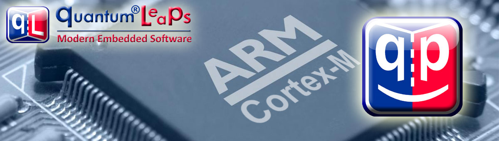

# What's New?
View QP/C Revision History at: https://www.state-machine.com/qpc/history.html

> **NOTE:** If you're interested in the latest QP/C version from GitHub,
it is recommened that you clone this repo like that:

```
git clone https://github.com/QuantumLeaps/qpc --recurse-submodules --depth 1
```

Alternatively, you can also download the latest
[QP/C Release](https://github.com/QuantumLeaps/qpc/releases).


# Getting Started with QP/C
The most recommended way of obtaining QP/C is by downloading the
[QP-bundle](https://www.state-machine.com/#Downloads), which includes QP/C
as well as the QM modeling tool and the QTools collection. The main advantage of
obtaining QP/C bundled together like that is that you get all components,
tools and examples ready to go.

### Getting Started Resources
- ["QP/C Tutorial"][Tutorial]
describes a series of progressively advanced QP/C example applications.

- [Video: "Getting Started with QP Real-Time Embedded Frameworks"][Video]
provides instructions on how to download, install, and get started with QP.

- [AppNote: "Getting Started with QP Real-Time Embedded Frameworks"][AN]
contains also a tutorial, in which you build a simple "Blinky" application.


# About QP/C
QP/C (Quantum Platform in C) is a lightweight, open source
[Real-Time Embedded Framework (RTEF)][RTEF] for building modern embedded
software as systems of asynchronous, event-driven [active objects][Active]
(actors). The [QP/C] framework is a member of a [QP] family consisting of
[QP/C] and [QP/C++] frameworks, which are strictly quality controlled,
thoroughly documented, and [commercially licensable][Lic].

## Safer Model of Concurrency
The [QP] framework family is based on the [Active Object][Active] (**actor**)
design pattern, which inherently supports and automatically enforces the
following best practices of concurrent programming:

- Keep data isolated and bound to active objects' threads. Threads should
hide (**encapsulate**) their private data and other resources, and not
share them with the rest of the system.

- Communicate among active object threads **asynchronously** via event
objects. Using asynchronous events keeps the threads running truly
independently, **without blocking** on each other.

- Active object threads should spend their lifetime responding to incoming
events, so their mainline should consist of an **event-loop** that handles
events one at a time (to completion), thus avoiding any concurrency hazards
within an active object thread itself.

This architecture is generally **safer**, more responsive and easier to
understand and maintain than the shared-state concurrency of a conventional
RTOS. It also provides higher level of abstraction and the *correct*
abstractions to effectively apply **modeling** and **code generation** to
deeply embedded real-time systems.

## Hierarchical State Machines
The behavior of active objects is specified in QP/C by means of
[Hierarchical State Machines][HSM] (UML statecharts). The framework
supports manual coding of UML state machines in C as well as automatic
**code generation** by means of the free [QM modeling tool][QM].

## Built-in Real-Time Kernels
The QP/C framework can run on bare-metal single-chip microcontrollers,
completely replacing a traditional RTOS. The framework contains a selection
of **built-in real-time kernels**, such as the cooperative QV kernel, the
preemptive non-blocking QK kernel, and the preemptive, blocking QXK kernel
that provides all the features you might expect from a traditional RTOS.
Native QP ports and ready-to-use examples are provided for major CPUs, such
as ARM Cortex-M (M0/M0+/M3/M4/M7).

## Traditional RTOS/OS
QP/C can also work with a traditional RTOS, such as ThreadX, FreeRTOS, embOS,
uC/OS-II and TI-RTOS, as well as with (embedded) Linux (POSIX) and Windows.

## Popularity and Maturity
With 20 years of continuous development, over [350 commercial licensees][Cust],
and many times more open source users worldwide, the QP™ frameworks are the
most popular such offering on the market. They power countless electronic
products ranging from implantable medical devices to complex weapon systems.


# QP/C Licensing
QP/C is licensed under the sustainable [dual licensing model][Lic],
in which both the open source software distribution mechanism and
traditional closed source software distribution models are combined.

> **NOTE:** If your company has a policy forbidding open source in your
product, all QP frameworks can be [licensed commercially][Lic], in which case
you don't use any open source license and you do not violate your policy.


# QP/C Documentation
The online HTML documention for the **latest** version of QP/C is located
at: https://www.state-machine.com/qpc

The offline HTML documentation for **this** particular version of QP/C
is located in the sub-folder [html](html). To view the offline documentation,
open the file [html/index.html](html/index.html) in your web browser.


# How to Get Help?
- [Free Support Forum](https://sourceforge.net/p/qpc/discussion/668726)
- [Bug Reports](https://sourceforge.net/p/qpc/bugs/)
- [Feature Requests](https://sourceforge.net/p/qpc/feature-requests/)
- [Quantum Leaps website](https://www.state-machine.com)
- [Quantum Leaps licensing](https://www.state-machine.com/licensing)
- [info@state-machine.com](mailto:info@state-machine.com)


# How to Help this Project?
If you like this project, please give it a star (in the upper-right corner of your browser window):


   [RTEF]: <https://www.state-machine.com/rtef>
   [QP]: <https://www.state-machine.com/products/qp>
   [QP/C]: <https://www.state-machine.com/qpc>
   [QP/C++]: <https://www.state-machine.com/qpcpp>
   [QM]: <https://www.state-machine.com/products/qm>
   [Active]: <https://www.state-machine.com/active-object>
   [HSM]: <https://www.state-machine.com/fsm#HSM>
   [Lic]: <https://www.state-machine.com/licensing>
   [Cust]: <https://www.state-machine.com/customers>
   [AN]: <https://www.state-machine.com/doc/AN_Getting_Started_with_QP.pdf>
   [Tutorial]: <https://www.state-machine.com/qpc/gs_tut.html>
   [Video]: <https://youtu.be/O7ER6_VqIH0>
