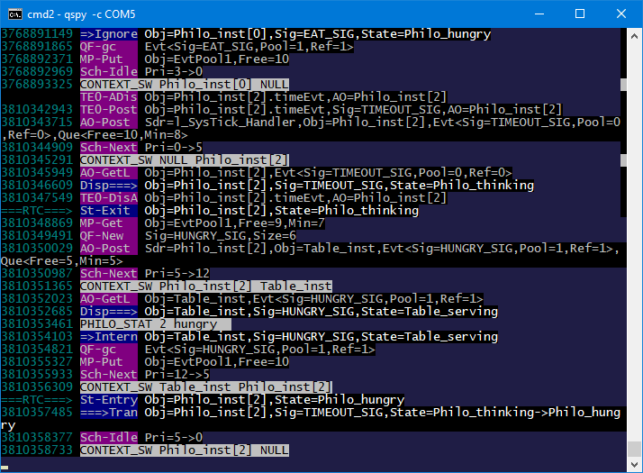

> **NOTE**
This file is best viewed in a **markdown viewer**, such as the one built into GitHub. Markdown viewers are also available as plug-ins to popular Internet browsers.

# About QP Examples for ARM Cortex-M (arm-cm)
This directory provides QP examples for ARM Cortex-M based MCUs.

These examples are intended to be used "as-is", or [adapted](#adapting-the-examples) for any ARM Cortex-M MCU that is not directly supported.

<p align="center">

</p>

> **NOTE**
The most simplifying factor is that the QP-ports to Cortex-M don't need to change at all (the correct port is selected automatically based on the standard preprocessor macros provided by the compiler).

# Example Applications
This directory contains two types of example applications:
- `blinky_<embedded-board>` demonstrates a [simple "blinky" application](https://www.state-machine.com/qpc/tut_blinky.html) with only one Active Object that periodically blinks an on-board LED. The "blinky" example is intentionally minimal and demonstrates only the QV and QK kernels (QXK is not demonstrated). Also, this example does not demonstrate the [QP/Spy software tracing](https://www.state-machine.com/qtools/qpspy.html).

- `dpp_<embedded-board>` demonstrates a more complete ["DPP" application (Dining Philosophers Problem)](https://www.state-machine.com/qpc/tut_dpp.html), with multiple, communicating Active Objects. The "dpp" example demonstrates all three built-in kernels (QV, QK, and QXK). Also, this example demonstrates the [QP/Spy software tracing](https://www.state-machine.com/qtools/qpspy.html).

# Supported Compilers
The following compilers/toolchains for ARM Cortex-M are supported and demonstrated:
- ARM-KEIL toolchain
- GNU-ARM toolchain
- IAR-ARM toolchain

## Build Configurations
- Debug
- Release
- Spy (only in the "DPP" examples)

# Adapting the Examples
With dozens of silicon vendors offering ARM Cortex-M MCUs, each providing hundreds if not thousands of MCU variants, it is *impossible* to offer direct support for each and every such MCU. But this is also not necessary because the already provided examples can be adapted relatively easily. The most important simplifying fact is that the [QP-ports to Cortex-M](https://www.state-machine.com/qpc/arm-cm.html) don't need to change at all.

This is how you might go about an MCU that is not directly supported in the `qpc/examples/arm-cm`:

- choose example that most closely matches your particular MCU. For instance, suppose that you're interested in NXP MKE02Z64VLC2, which is based on the Cortex-M0+ core, the closest are the examples for NUCLEO-C031C6 (also based on M0+)

- choose the kernel you'd like to use. For example, assuming that you like QK, you are interested in the qk subdirectory.

- choose the compiler you'd like to use. For example, assuming that you like GNU-ARM, you are interested in the gnu subdirectory

- build the chosen example project. Again, it **doesn't matter** at this stage that it is not exactly your final hardware. Your objective is testing your QP installation and the compiler installation. You are also getting familiar with QP. These goals are worth but a few minutes of your time.

- at this point, it is highly recommend that you just buy one of the supported ARM Cortex-M boards, which are carefully chosen to be very inexpensive. With your own board, you'd be able to run and debug the QP application at your desk, which is priceless because as you surely remember: *In embedded systems NOTING works until EVERYTHING works*.

- only *after* you get started with a working example, you can try to modify it for your own board. This typically requires only changes to the BSP (Board Support Package), which is provided in the `bsp.c` file.


# Code Organization
The following listing shows a typical organization of the example code:
```
examples\arm-cm\dpp_nucleo-c031c6
|
+---qk             // preemptive QK kernel
|   +---gnu        // GNU-ARM toolchain
|   |   \---targetConfigs
|   |       Makefile          // Makefile for GNU-ARM
|   +---armclang   // ARM/KEIL toolchain with Compiler 6 (ARM/CLANG)
|   |       dpp-qk.uvprojx // uVision project
|   \---iar        // IAR EWARM
|           dpp-qk.eww     // IAR EW-ARM workspace
|
\---qv             // cooperative QK kernel
|   +---gnu        // GNU-ARM toolchain
|   |   \---targetConfigs
|   |       Makefile          // Makefile for GNU-ARM
|   +---armclang   // ARM/KEIL toolchain with Compiler 6 (ARM/CLANG)
|   |       dpp-qv.uvprojx // uVision project
|   \---iar        // IAR EWARM
|           dpp-qv.eww     // IAR EW-ARM workspace
|
+---qxk            // preemptive, dual-mode QXK kernel
|   +---gnu        // GNU-ARM toolchain
|   |   \---targetConfigs
|   |       Makefile          // Makefile for GNU-ARM
|   +---armclang   // ARM/KEIL toolchain with Compiler 6 (ARM/CLANG)
|   |       dpp-qxk.uvprojx // uVision project
|   \---iar        // IAR EWARM
|           dpp-qxk.eww     // IAR EW-ARM workspace
|
```

# Building the example

### GNU/ARM
- open terminal window
- change to the desired directory (either `examples\arm-cm\dpp_nucleo-c031c6\qk\gnu`, `examples\arm-cm\dpp_nucleo-c031c6\qv\gnu`, or `examples\arm-cm\dpp_nucleo-c031c6\qxk\gnu`)
- to build the default Debug configuration, type:

```
make
```

> **NOTE**
The `make` utility for Windows is provided in the QTools collection for Windows.

- to build the Release configuration, type:

```
make CONF=rel
```

- to build the Spy configuration, type:

```
make CONF=spy
```


### ARM/KEIL MDK
- Open the provided KEIL uVision project (either `dpp-qk.uvprojx`, `dpp-qv.uvprojx`, or `dpp-qxk.uvprojx`)
in Keil uVision IDE. Build/Debug/Download to the board from the IDE.
- Change the build configuration in the "Project Target" drop-down menu.


### IAR EWARM
- Open the provided IAR EWARM workspace (either `dpp-qk.eww`, `dpp-qv.eww`, or `dpp-qxk.eww`)
in IAR EWARM IDE. Build/Debug/Download to the board from the IDE.
- Change the build configuration in the "Project Configuration" drop-down menu.


# Tracing with QP/Spy
When the board is flashed with the Spy build configuration, it produces the QP/Spy software tracing output to the built-in virtual COM port of the TivaC LauchPad board. The trace is binary rather than ASCII, and therefore requires a special host-based application called QSPY.

> **NOTE** QSPY host application is available in the QTools collection.

To launch the QSPY host application:
- open terminal window
- type:

```
qspy -c COM5
```

where "COM5" is an example virtual COM port enumerated by the board. You need to check the specific COM port number on your host computer using the Device Manager application, Ports (COM and LPT) section.


The following screen shot shows a typical output from QSPY:

<p align="center">
<br>
<b>Typical QSPY output produced by the Spy build configuration</b>
</p>
