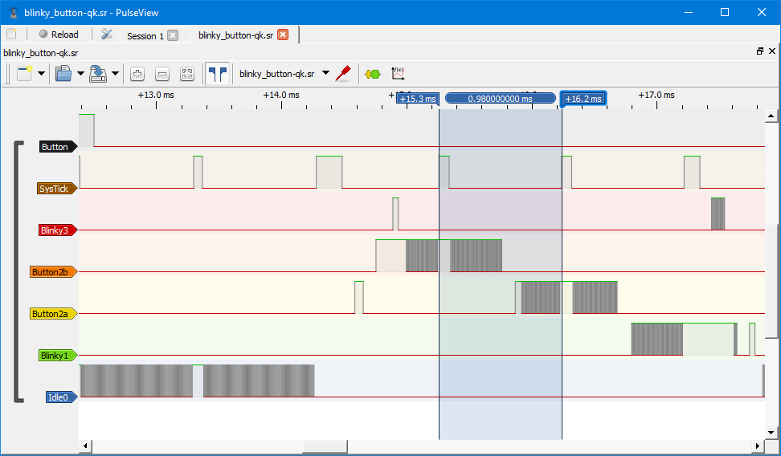
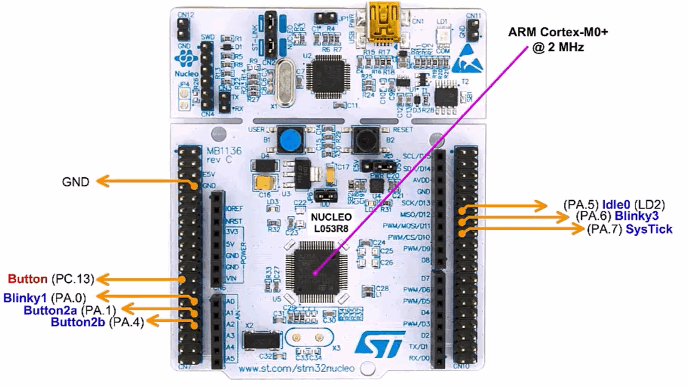

> **NOTE**
This file is best viewed in a **markdown viewer**, such as the one built into GitHub. Markdown viewers are also available as plug-ins to popular Internet browsers.

# Blinky-Button on NUCLEO-L053R8
This example implements the "Blinky-Button" application on the STM32 NUCLEO-L053R8 board (ARM Cortex-M0+). The example demonstrates various preemption scenarios (after pressing the User Button) in the preemptive **QK kernel**. The example requires a *logic analyzer*.

<p align="center">
<br>
<b>STM32 NUCLEO-L053R8</b>
</p>

## Features Demonstrated

<p align="center">
<br>
<b>Logic analyzer trace after pressing the button</b>
</p>

- preemptive run-to-completion QK kernel
  + with ARM-KEIL toolchain

## Build Configurations
- Debug
- Release
- Spy - NOT provided

# Code Organization
```
examples\arm-cm\blinky_button_nucleo-l053r8
|
+---qk             // preemptive QK kernel
|   +---armclang   // ARM/KEIL toolchain with Compiler 6 (ARM/CLANG)
|   |       bb-qk.uvprojx // uVision project
|
```

# Builing the example

### ARM/KEIL MDK
- Open the provided KEIL uVision project (`bb-qk.uvprojx`)
in Keil uVision IDE. Build/Debug/Download to the board from the IDE.

# Connecting a Logic Analyzer
The NUCLEO-L053R8 needs to be conntected to a logic analyzer as shown in the following picture:

<p align="center">
<br>
<b>Connecting the NUCLEO-L053R8 to a logic analyzer</b>
</p>


