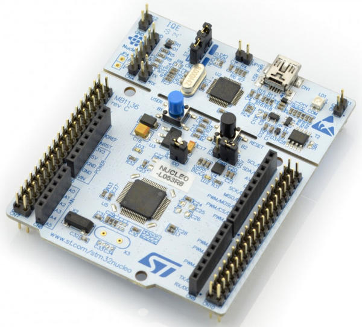
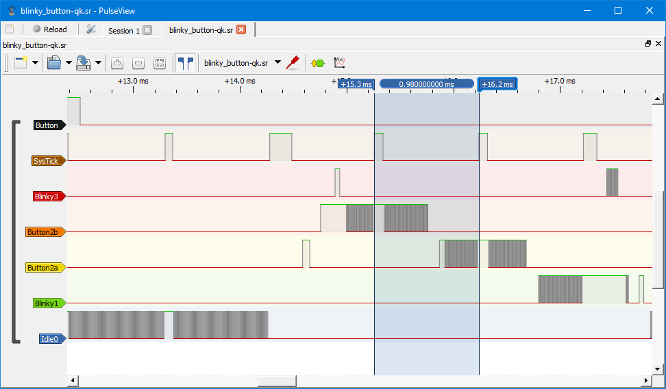
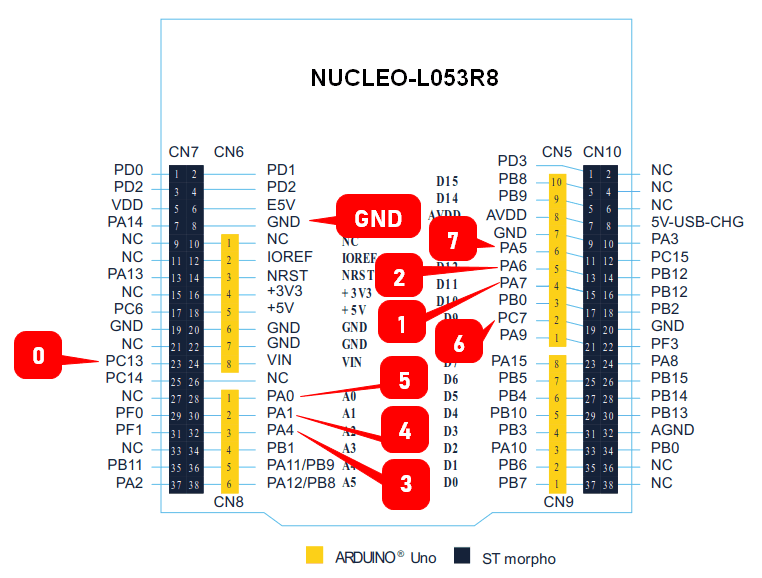

> **NOTE**
This file is best viewed in a **markdown viewer**, such as the one built into GitHub. Markdown viewers are also available as plug-ins to popular Internet browsers.

# Real-Time Example on NUCLEO-L053R8
This example implements the "Periodic-Sporadic" application on the STM32 NUCLEO-L053R8 board (ARM Cortex-M0+). The example demonstrates various real-time preemption scenarios among active objects in the **QK** and **QV** kernels. The example requires a **logic analyzer**.

<p align="center">
<br>
<b>STM32 NUCLEO-L053R8</b>
</p>

<p align="center">
<br>
<b>Logic analyzer trace after pressing the button (QK kernel)</b>
</p>

# Code Organization
```
examples\arm-cm\real-time_nucleo-l053r8
|
+---qk             // preemptive QK kernel
|   +---armclang   // ARM/KEIL MDK with Compiler 6 (ARM/CLANG)
|   |       rt-qk.uvprojx // uVision project
|
+---qv-ms          // cooperative QV kernel (multi-stage tasks)
|   +---armclang   // ARM/KEIL MDK with Compiler 6 (ARM/CLANG)
|   |       rt-qv-ms.uvprojx // uVision project
|
+---qv-tt          // cooperative QV kernel (time-triggered)
|   +---armclang   // ARM/KEIL MDK with Compiler 6 (ARM/CLANG)
|   |       rt-qv-tt.uvprojx // uVision project

```

## Features Demonstrated
The example QP application consists of 2 periodic threads (Active Objects) and two sporadic, lon-running threads (Active Objects). Additionally, the Time-Triggered (TT) version has a tt-schedulier thread.

- directory `qk`: preemptive run-to-completion QK kernel

- directory `qv-ms`: cooperative run-to-completion QV kernel with multi-stage tasks

- directory `qv-tt`: cooperative run-to-completion QV kernel with time-triggered tasks

# Builing the Examples

## ARM/KEIL MDK
- Open one of the provided KEIL uVision projects (e.g., `rt-qk.uvprojx`) in Keil uVision IDE. Build/Debug/Download to the board from the IDE.


# Running the Examples

## Setting up a Logic Analyzer
The NUCLEO-L053R8 needs to be conntected to a logic analyzer as shown in the picture below.

<p align="center">
<br>
<b>Connecting STM32 NUCLEO-L053R8 to a logic analyzer</b>
</p>


The logic analyzer needs to be configured as follwos:
- sampling rate: several MHz (e.g., 24MHz)
- trigger: Sporadic (PC.13 on the NUCLEO-L053R8), falling edge
- pre-trigger capture ratio: 20%
