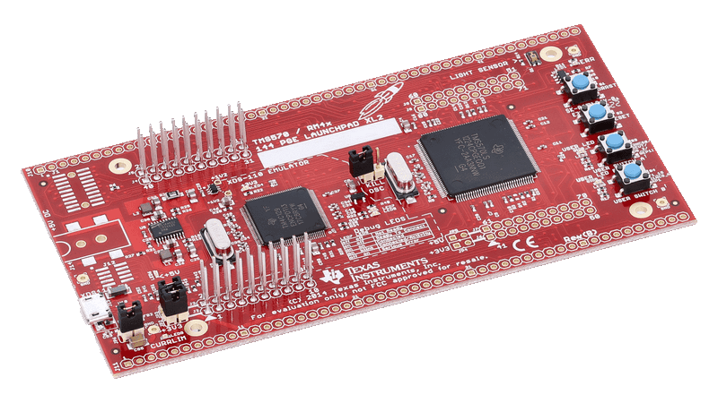

> **NOTE**
This file is best viewed in a **markdown viewer**, such as the one built into GitHub. Markdown viewers are also available as plug-ins to popular Internet browsers.

# Blinky on LAUNCHXL2-TMS57012 board
This example implements the simple [Blinky application](https://www.state-machine.com/qpc/tut_blinky.html) on the LAUNCHXL2-TMS57012 board (ARM Cortex-R4F). The example blinks the LED
on the LAUNCHXL2-TMS57012 board at 1Hz (0.5 seconds on, 0.5 seconds off).

<p align="center">
<br>
<b>LAUNCHXL2-TMS57012 board</b>
</p>

## Features Demonstrated
- cooperative QV kernel
  + with IAR-ARM toolchain
  + with TI-ARM toolchain (in Code Composer Studio)
- preemptive run-to-completion QK kernel
  + with IAR-ARM toolchain
  + with TI-ARM toolchain (in Code Composer Studio)

## Build Configurations
- Debug
- Release
- Spy - NOT supported for the simple Blinky example

# Code Organization
```
examples\arm-cr\blinky_launchxl2-tms57012
|
+---qk             // preemptive QK kernel
|   +---iar        // IAR EWARM
|   |       blinky-qk.eww     // IAR EW-ARM workspace
|   \---ti         // TI CCS
|       \---targetConfigs     // CCS project (target config)
|           .ccsproject       // CCS project
|           .cproject         // CCS project
|           .project          // CCS project
|
\---qv             // cooperative QV kernel
|   +---iar        // IAR EWARM
|   |       blinky-qv.eww     // IAR EW-ARM workspace
|   \---ti         // TI CCS
|       \---targetConfigs     // CCS project (target config)
|           .ccsproject       // CCS project
|           .cproject         // CCS project
|           .project          // CCS project
```

# Building the example

### IAR EWARM
- Open the provided IAR EWARM workspace (either `blinky-qk.eww` or `blinky-qv.eww`)
in IAR EWARM IDE. Build/Debug/Download to the board from the IDE.
- Change the build configuration in the "Project Configuration" drop-down menu.

### TI CCS
- Import the provided CCS project (either `examples\arm-cr\blinky_launchxl2-tms57012\qk\ti`
or `examples\arm-cr\blinky_launchxl2-tms57012\qv\ti`).
- Change the build configuration in the "Build" drop-down menu.


