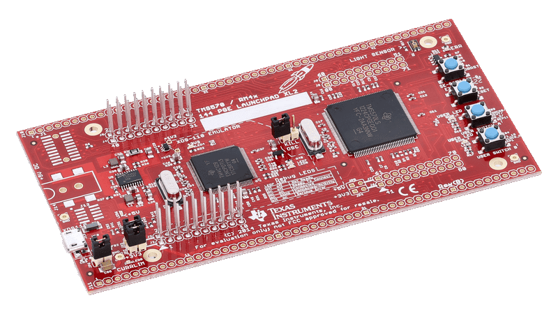
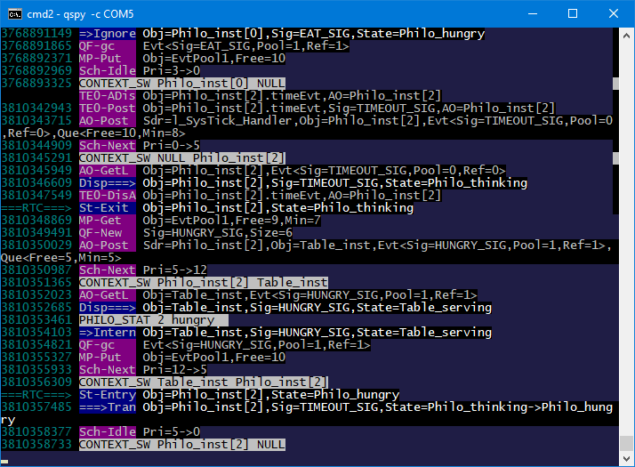

> **NOTE**
This file is best viewed in a **markdown viewer**, such as the one built into GitHub. Markdown viewers are also available as plug-ins to popular Internet browsers.

# DPP on LAUNCHXL2-TMS57012 board
This example implements the [Dining Philosophers Problem (DPP) application](https://www.state-machine.com/qpc/tut_dpp.html) on the LAUNCHXL2-TMS57012 board (ARM Cortex-R4F). The example blinks the LED on the LAUNCHXL2-TMS57012 board at 1Hz (0.5 seconds on, 0.5 seconds off).

<p align="center">
<br>
<b>LAUNCHXL2-TMS57012 board</b>
</p>

## Features Demonstrated
- multiple cooperating active objects
- immutable (const) events
- mutable (dynamic) events
- time events
- direct event posting
- publish-subscribe event delivery
- cooperative QV kernel
  + with IAR-ARM toolchain
  + with TI-ARM toolchain (in Code Composer Studio)
- preemptive run-to-completion QK kernel
  + with IAR-ARM toolchain
  + with TI-ARM toolchain (in Code Composer Studio)

## Build Configurations
- Debug
- Release
- Spy - software tracing with the built-in virtual COM port

# Code Organization
```
examples\arm-cr\dpp_launchxl2-tms57012
|
+---qk             // preemptive QK kernel
|   +---iar        // IAR EWARM
|   |       blinky-qk.eww     // IAR EW-ARM workspace
|   \---ti         // TI CCS
|       \---targetConfigs     // CCS project (target config)
|           .ccsproject       // CCS project
|           .cproject         // CCS project
|           .project          // CCS project
|
\---qv             // cooperative QV kernel
|   +---iar        // IAR EWARM
|   |       blinky-qv.eww     // IAR EW-ARM workspace
|   \---ti         // TI CCS
|       \---targetConfigs     // CCS project (target config)
|           .ccsproject       // CCS project
|           .cproject         // CCS project
|           .project          // CCS project
```

# Building the example

### IAR EWARM
- Open the provided IAR EWARM workspace (either `blinky-qk.eww` or `blinky-qv.eww`)
in IAR EWARM IDE. Build/Debug/Download to the board from the IDE.
- Change the build configuration in the "Project Configuration" drop-down menu.

### TI CCS
- Import the provided CCS project (either `examples\arm-cr\dpp_launchxl2-tms57012\qk\ti`
or `examples\arm-cr\dpp_launchxl2-tms57012\qv\ti`).
- Change the build configuration in the "Build" drop-down menu.

# Tracing with QP/Spy
When the board is flashed with the Spy build configuration, it produces the QP/Spy software tracing output to the built-in virtual COM port of the LAUNCHXL2-TMS57012 board. The trace is binary rather than ASCII, and therefore requires a special host-based application called QSPY.

> **NOTE** QSPY host application is available in the QTools collection.

To launch the QSPY host application:
- open terminal window
- type:

```
qspy -c COM5
```

where "COM5" is an example virtual COM port enumerated by the board. You need to check the specific COM port number on your host computer using the Device Manager application, Ports (COM and LPT) section.


The following screen shot shows a typical output from QSPY:

<p align="center">
<br>
<b>Typical QSPY output produced by the Spy build configuration</b>
</p>

