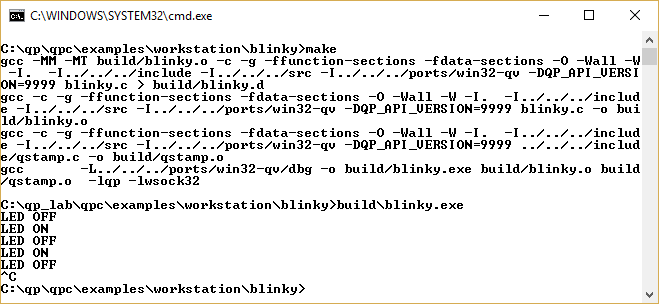

@page exa_workstation_blinky Example: Blinky Console



# Example: Blinky Console

This example corresponds to the QM Tutorial at:

https://www.state-machine.com/qm/gs_tut.html


Specifically the files are as follows:

```
blinky.qm - the QM model for the Blinky active object
blinky.c  - the generated code for the Blinky application
Makefile  - the makefile to build Blinky on Windows/Linux/macOS
```
